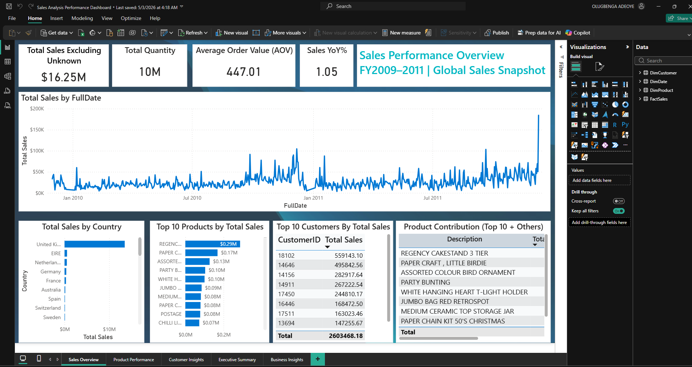
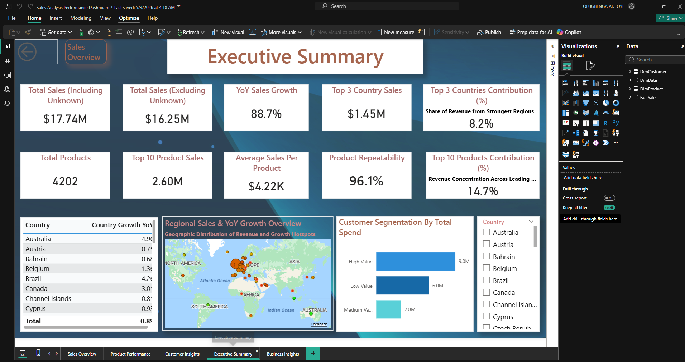

# 📊 Sales Performance Dashboard
**Tools:** Power BI | DAX | SQL Server

## Overview
An interactive Power BI dashboard visualising sales trends, product performance,
and regional targets — designed for executive-level reporting with dynamic titles
and bookmarks for presentation use.

## Key Features
- Sales trend analysis across time periods
- Product-level performance breakdown
- Regional target vs. actuals comparison
- Dynamic titles and bookmarks for executive presentations
- Row-level security for multi-team access

## Tech Stack
- **Visualisation:** Power BI Desktop & Service
- **Data Modelling:** Star schema, DAX (calculated measures & KPIs)
- **Data Source:** SQL Server (ETL via Power Query)

## Screenshots

.

## How to Use
1. Download the `.pbix` file
2. Open in Power BI Desktop
3. Connect to your SQL Server data source
4. Refresh the data model

## Author
**Olugbenga Adeoye** — Data Analyst | Power BI Developer
[LinkedIn](https://www.linkedin.com/in/olugbenga-adeoye-72713b253/)
