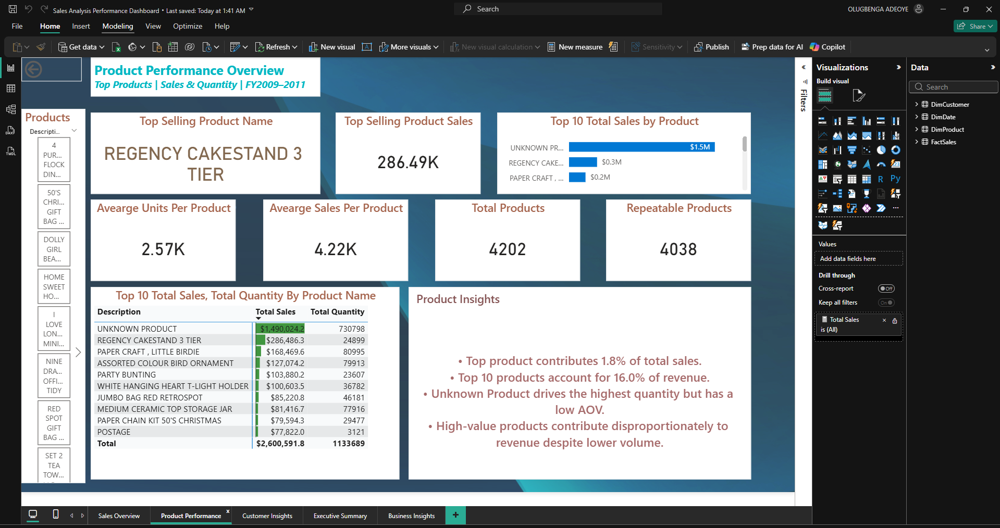
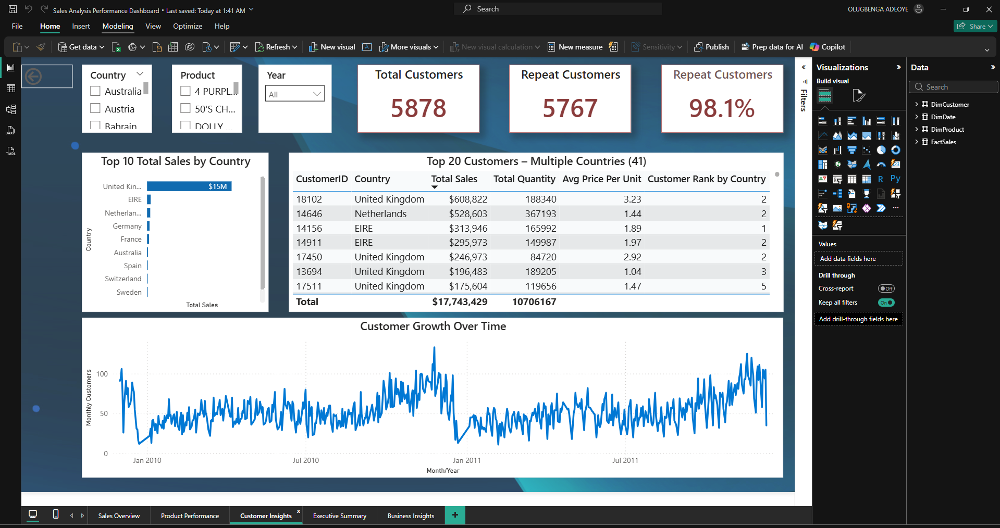
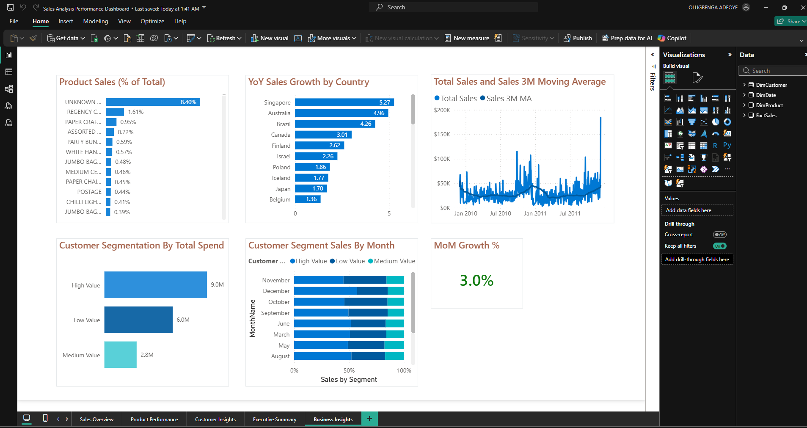

# 📊 Sales Analysis Performance Dashboard
**Tools:** Power BI | DAX | SQL Server | Power Query

> 🔒 Interactive version available on request — connect via [LinkedIn](https://www.linkedin.com/in/olugbenga-adeoye-72713b253/)

---

## Overview
A multi-page interactive Power BI dashboard analysing global sales performance across FY2009–2011. Built to support executive decision-making through dynamic visuals, drill-through capabilities, bookmarks, and customer segmentation — covering $17.74M in total sales across 41 countries and 4,202 products.

---

## Key Metrics at a Glance

| Metric | Value |
|--------|-------|
| Total Sales (incl. Unknown) | $17.74M |
| Total Sales (excl. Unknown) | $16.25M |
| YoY Sales Growth | 88.7% |
| Total Quantity Sold | 10M |
| Average Order Value (AOV) | $447.01 |
| Total Customers | 5,878 |
| Repeat Customers | 5,767 (98.1%) |
| Total Products | 4,202 |
| Product Repeatability | 96.1% |
| MoM Growth | 3.0% |

---

## Dashboard Pages

### 1. 🗂️ Sales Overview
*Global sales snapshot across FY2009–2011*

- Total sales trend by date (Jan 2010 – Dec 2011)
- Top 10 products and customers by total sales
- Sales breakdown by country (UK leading at ~$15M)
- Product contribution analysis (Top 10 + Others)

---

### 2. 🏆 Product Performance
*Top products | Sales & Quantity | FY2009–2011*

- Top selling product: **Regency Cakestand 3 Tier** ($286.49K)
- Average units per product: 2.57K | Average sales per product: $4.22K
- Repeatable products: 4,038 out of 4,202
- Top 10 product table with total sales and quantity
- Key insight: High-value products contribute disproportionately to revenue despite lower volume

---

### 3. 👥 Customer Insights
*Customer behaviour, segmentation & growth*

- 98.1% repeat customer rate — strong loyalty indicator
- Top 20 customers across 41 countries with ranked spend
- UK dominates with $15M in customer sales
- Customer growth trend over time (Jan 2010 – Dec 2011)
- Filterable by Country, Product, and Year

---

### 4. 📋 Executive Summary
*High-level KPIs for leadership reporting*

- Top 3 country sales: $1.45M | Top 3 countries contribution: 8.2%
- Top 10 product contribution: 14.7% of total revenue
- Regional Sales & YoY Growth map — geographic distribution of revenue hotspots
- Customer segmentation by total spend: High ($9.0M) | Low ($6.0M) | Medium ($2.8M)
- Dynamic titles and bookmarks optimised for executive presentations

---

### 5. 📈 Business Insights
*Advanced analytics | Trends & Segmentation*

- Product sales as % of total — concentration and spread analysis
- YoY sales growth by country: Singapore (5.27x), Australia (4.96x), Brazil (4.26x)
- Total sales vs 3-month moving average (3M MA) trend line
- Customer segmentation by total spend per month
- Customer segment sales by month (High / Low / Medium value split)
- MoM Growth: **3.0%**

---

## Tech Stack

| Layer | Tools Used |
|-------|-----------|
| **Visualisation** | Power BI Desktop & Service |
| **Data Modelling** | Star schema (DimCustomer, DimDate, DimProduct, FactSales) |
| **DAX** | Calculated measures, KPIs, YoY%, MoM%, moving averages, dynamic titles |
| **ETL** | Power Query (M), SQL Server |
| **Features** | Bookmarks, drill-through, row-level security, dynamic filtering |

---

## Data Model
Built on a **star schema** with four tables:
- `FactSales` — transactional sales records
- `DimCustomer` — customer dimension
- `DimProduct` — product catalogue
- `DimDate` — full date table supporting time intelligence

---

## How to Use
1. Download the `.pbix` file from this repository
2. Open in **Power BI Desktop**
3. Connect to your SQL Server data source
4. Refresh the data model
5. Navigate pages using the tabs at the bottom

---

## Author
**Olugbenga Adeoye**
Data Analyst | Power BI Developer | London, UK

> 💼 Open to Data Analyst and Power BI Developer opportunities — feel free to reach out!
